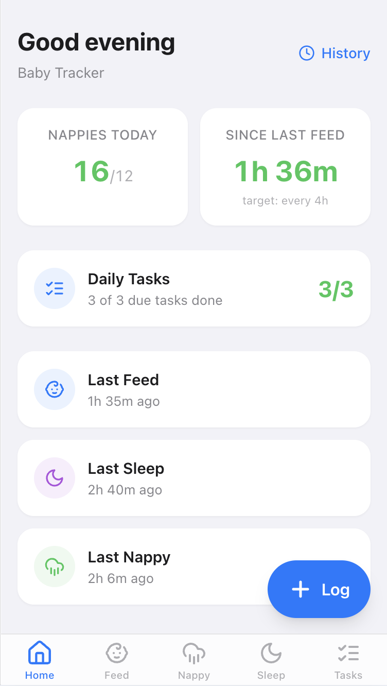
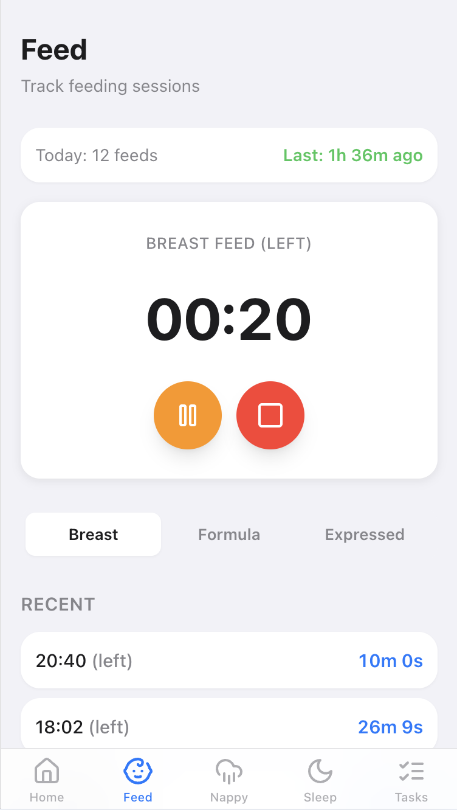
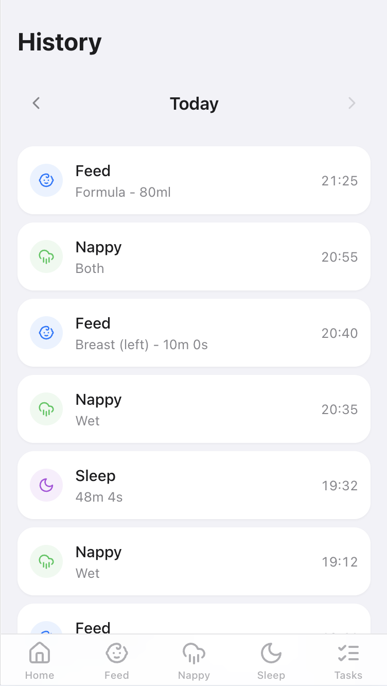

# Baby Tracker

A shared baby tracking PWA for logging sleep, feeds, nappies, pumping sessions, and growth measurements.

I originally used [Jeeves](https://github.com/eddmann/jeeves) (my AI assistant) to help manage baby tracking through conversational commands. It worked well, but I wanted something with a dedicated UI that I could share with my wife and iterate on independently from the assistant itself.

Built so two parents can track everything from their phones with no accounts — just a shared PIN.

## Screenshots

<p align="center">
  
  
  
</p>

## Features

- Sleep — start/pause/resume/stop timer, duration tracking
- Feeds — breast (timer with left/right side), formula (ml), expressed (ml)
- Nappies — one-tap logging: wet, dirty, or both
- Pump — timer with amount (ml) on stop
- Growth — weight (kg/lbs) and height (cm/in) tracking
- Daily Tasks — recurring to-dos with configurable frequency and start dates
- Dashboard — time-since cards, active timers visible to both users, quick-add sheet
- History — daily timeline, weekly summary stats

## Architecture

### Client

React + Redux Toolkit + React Router SPA with an iOS-inspired design system (Tailwind CSS).

- UI and routes in `src/`
- API client in `src/lib/api.ts`

### API

Cloudflare Workers + Hono + D1 SQLite with layered architecture and manual dependency injection:

- Routes: `worker/routes/` (HTTP handlers, Zod validation)
- Use cases: `worker/usecases/` (business logic)
- Repositories: `worker/repositories/` (interface + D1 implementations)
- Timer logic: `worker/utils/timer.ts` (elapsed time with pause support)

Timer state is server-authoritative — both users see active timers via dashboard polling.

## Development

```bash
make start             # Install deps, migrate, run dev server
make can-release       # CI gate — lint + test
make build             # Build for production
```

Run `make` to see all available targets.

### Database

```bash
make db                # Reset + migrate local
make db/remote         # Migrate remote
```

### Deployment

```bash
make ship              # Typecheck, build, migrate remote, deploy
```

## License

[MIT License](LICENSE)
